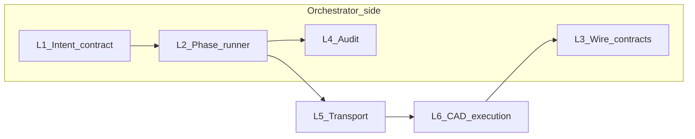

# Layered practice playbook (InGENeer / AutonomAtIon)

**How to use this doc:** Pick the layer you are touching, read its checklist, then change code or docs. **Full authority** for invariants and Cursor SOPs remains **[AUTONOMATION_SYSTEM_ARCHITECTURE_RULES.md](AUTONOMATION_SYSTEM_ARCHITECTURE_RULES.md)**—this file maps those rules to **concrete paths and pipeline steps**.

**Cursor:** When you work under `docs/governance/autonomation/`, `schemas/`, `docs/`, `orchestrator/`, or `README.md`, the project rule **AutonomAtIon architecture (InGENeer)** auto-attaches (`.cursor/rules/autonomation-architecture.mdc`). If a chat has no matching files in context, open or `@`-mention one of those paths.

**Model choice:** See [docs/AI_ASSISTANT_BEST_PRACTICES.md](../docs/AI_ASSISTANT_BEST_PRACTICES.md) for when to use Claude Max, Gemini Ultra, or Codex Pro on this repo.

---

## Versioning (two numbers)

| Artifact | Field / constant | Current | Bump when |
|----------|------------------|---------|-----------|
| Intent envelope | `schemaVersion` in JSON + `CadIntentEnvelope` | `1.1.0` | Breaking change to envelope fields |
| Wire / contract payloads | `ingenieer.contracts.SCHEMA_VERSION` | `1.0.0` | Breaking change to outer contract shape |

See also [docs/INTENT_COMMAND_CATALOG.md](../docs/INTENT_COMMAND_CATALOG.md) versioning section.

---

## Layer model

| Layer | Name | Primary artifacts |
|-------|------|-------------------|
| L0 | Product and boundaries | [AUTONOMATION_SYSTEM_ARCHITECTURE_RULES.md](AUTONOMATION_SYSTEM_ARCHITECTURE_RULES.md), [README.md](../README.md) |
| L1 | Intent contract | [schemas/cad_intent_envelope.schema.json](../schemas/cad_intent_envelope.schema.json), [docs/INTENT_COMMAND_CATALOG.md](../docs/INTENT_COMMAND_CATALOG.md), `CadIntentEnvelope` in `orchestrator/src/ingenieer/models.py` |
| L2 | Orchestrator runtime | `orchestrator/src/ingenieer/orchestrator.py` (`PHASE_ORDER`, phase classes), `OrchestratorConfig` / `OrchestratorContext` in `models.py` |
| L3 | Wire and outer contracts | `orchestrator/src/ingenieer/contracts.py`, `orchestrator/src/ingenieer/wire.py` (`BridgeExecutionResult`) |
| L4 | Audit and traceability | `orchestrator/src/ingenieer/audit.py` |
| L5 | Transport (bridge) | *Not in repo yet*—queue, RPC, timeouts; must match envelope + result contracts |
| L6 | CAD execution (host) | *Future C# iCAD add-in*—UI thread, native transactions, command dispatch |

**Cross-cutting:** Air-gapped workspaces, custom docs, modality matrix, micro-diff audit, git bailout—**SOPs 2–6** in the architecture rules—apply to every layer, especially L1–L3 and L6.

---

## Pipeline phases vs layers

Phases live in `orchestrator/src/ingenieer/orchestrator.py`.

| Phase | Layers | Practice focus |
|-------|--------|----------------|
| `validate_intent` | L1, L2 | Pydantic + schema; catalog-aligned `command`; no geometry |
| `sync_baseline` | L2, L5/L6 when real | Fingerprint from host; fail closed if `modelFingerprintExpected` mismatches |
| `dispatch_execute` | L5, L6 | Serialize envelope; host queues work on UI thread; transactional mutation + rollback |
| `verify_result` | L6, L3, L2 | Live fingerprint vs `telemetry.modelFingerprintAfter`; `max_verification_attempts` + `verification_backoff_sec` **only** for transient transport failures on the verify read |

---

## L0 — Product and boundaries

- **Purpose:** Keep product names, host targets, and “who owns what” obvious.
- **Owned artifacts:** Architecture rules, README.
- **Allowed:** Clarify scope (InGENeer vs AIrchetect), update execution targets when hosts change.
- **Forbidden:** Weakening domain isolation or threading rules to “move faster.”
- **Inputs / outputs:** N/A (governance).
- **Safe change workflow:** Chat/planning tier; small doc edits inline.
- **Definition of done:** Wording matches actual repos and hosts; SOP 3 doc list updated when doc sources change.
- **Cross-links:** Architecture rules §1, naming table, document control.

---

## L1 — Intent contract

- **Purpose:** Single stable shape from LLM boundary to bridge: intent id, command name, parameters, optional document/fingerprint fields.
- **Owned artifacts:** `schemas/cad_intent_envelope.schema.json`, `docs/INTENT_COMMAND_CATALOG.md`, `CadIntentEnvelope` in `models.py`.
- **Allowed:** Bump `schemaVersion` with synchronized schema + model + catalog notes; add catalog rows **with** API backing (architecture rule 4).
- **Forbidden:** Undocumented commands; geometry or host calls in the envelope; diverging schema and Pydantic without a version bump.
- **Inputs / outputs:** JSON envelope ↔ `CadIntentEnvelope`.
- **Safe change workflow:** Air-gap: share schema text to the CAD workspace when defining C# DTOs (SOP 2).
- **Definition of done:** Tests still pass; catalog and schema agree; breaking changes documented.
- **Cross-links:** Architecture rules §1 (orchestrator scope), §4 (no API hallucinations), §5 (preservation).

---

## L2 — Orchestrator runtime

- **Purpose:** Deterministic phase runner with explicit failure stops and context merging.
- **Owned artifacts:** `orchestrator.py`, pipeline models in `models.py`.
- **Allowed:** Phase logic, stubs that return structured `PhaseResult`, config-driven limits (e.g. verification retries).
- **Forbidden:** CAD API calls; B-rep or coordinate solving; swallowing exceptions without audit/logging (preserve pipeline behavior).
- **Inputs / outputs:** `CadIntentEnvelope` → `PipelineResult` / `OrchestratorContext`.
- **Safe change workflow:** Cmd+K for surgical phase edits; run `ruff check src tests` and `pytest`.
- **Definition of done:** `ruff check src tests` and `pytest -q` clean (from `orchestrator/`); phases emit audit events via runner; no new non-deterministic side effects in core path.
- **Cross-links:** Architecture rules §1, §5; SOP 4–6.

---

## L3 — Wire and outer contracts

- **Purpose:** Canonical envelopes for artifacts crossing the wire; path hygiene; bridge result shape.
- **Owned artifacts:** `contracts.py`, `wire.py` (`BridgeExecutionResult`, `as_contract`).
- **Allowed:** `build_contract_payload` / validation helpers; explicit invariants lists; scalar metadata rules.
- **Forbidden:** Absolute paths or `..` in contract `paths` (see `contracts.py`); inventing new top-level keys without versioning story.
- **Inputs / outputs:** Python dicts ↔ JSON payloads; `BridgeExecutionResult` ↔ contract document.
- **Safe change workflow:** Composer OK for scaffolding; validate with contract tests.
- **Definition of done:** `tests/test_contracts.py`, `tests/test_wire.py` pass; `SCHEMA_VERSION` bumped if contract breaks consumers.
- **Cross-links:** Architecture rules §1, §5.

---

## L4 — Audit and traceability

- **Purpose:** Append-only, hash-chained JSONL for phase and pipeline events.
- **Owned artifacts:** `audit.py`, audit config in `models.py`.
- **Allowed:** New `event_type` strings with stable payloads; verification helpers in `audit.py`.
- **Forbidden:** Rewriting or deleting prior log lines; dropping hash chain fields.
- **Inputs / outputs:** `AuditLogger.log(event_type, data)`.
- **Safe change workflow:** Small edits + `tests/test_audit.py`.
- **Definition of done:** Tests pass; new events documented if external tools consume them.
- **Cross-links:** Architecture rules §5.

---

## L5 — Transport (bridge)

- **Purpose:** Move validated intents to the host and return structured results; operational concerns (timeouts, retries, idempotency by `intentId`).
- **Owned artifacts:** [docs/BRIDGE_TRANSPORT.md](../docs/BRIDGE_TRANSPORT.md); `orchestrator/src/ingenieer/bridge_client.py`; `dispatch_execute` / `sync_baseline` in `orchestrator.py`; optional HTTP reference under [icad-addin/](../icad-addin/).
- **Allowed:** Thin client in orchestrator; correlation ids; explicit failure modes mapped to `PhaseResult`.
- **Forbidden:** Business geometry in transport layer; silent drops; path injection.
- **Inputs / outputs:** Serialized `CadIntentEnvelope` ↔ bytes/frames on wire ↔ parsed bridge response.
- **Safe change workflow:** Specify wire format in docs; implement in orchestrator repo or shared package without breaking L1/L3.
- **Definition of done:** `NoOp` / `PingHost` round-trip works against a test double or real add-in.
- **Cross-links:** Architecture rules §1–3; SOP 2 (schema handoff).

---

## L6 — CAD execution (host)

- **Purpose:** Map `command` strings to **documented** host APIs inside **UI-thread** work and **native transactions** with rollback.
- **Owned artifacts:** *Future C# iCAD add-in* (separate repo recommended; air-gapped Cursor window).
- **Allowed:** Strictly typed DTOs from envelope JSON; telemetry in bridge result; deterministic branching only.
- **Forbidden:** LLM calls; `async` mutation without vendor docs; guessed API symbols (rule 4—use `// TODO` + doc snippet).
- **Inputs / outputs:** Intent DTO → host document state → `BridgeExecutionResult` (or equivalent).
- **Safe change workflow:** Tier 2 inline edits with `@` vendor doc; never mix orchestrator and plugin in one Composer session (SOP 2).
- **Definition of done:** Command covered in catalog; integration test or manual script; transaction rollback verified on forced failure.
- **Cross-links:** Architecture rules §§1–5; SOP 3.

---

## Naming (quick reference)

| Name | Meaning |
|------|---------|
| **InGENeer** | Civil / survey / construction CAD (this repo’s orchestrator + contracts). |
| **AIrchetect** | Mechanical 3D CAD track (e.g. FreeCAD worker)—same orchestrator vs execution split. |
| **AutonomAtIon** | Parent program: boundaries between orchestration and execution. |

---

## Document control

- **Companion to:** [AUTONOMATION_SYSTEM_ARCHITECTURE_RULES.md](AUTONOMATION_SYSTEM_ARCHITECTURE_RULES.md).
- **When to update:** New phase, new contract version, new host, or new transport; keep phase↔layer table and versioning table in sync with code.
